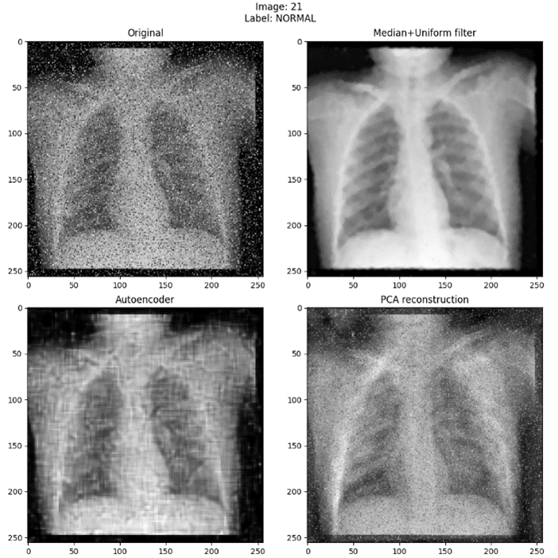

# AAIB Assignment 2022: X-Ray images classifier for PNEUMONIA and TUBERCULOSIS

## Introduction
Lung pathologies such as tuberculosis and pneumonia significantly impact individuals worldwide. Tuberculosis is caused by *Mycobacterium tuberculosis* and is primarily transmitted through airborne droplets, leading to symptoms like fever, night sweats, and weight loss. Pneumonia, caused by various bacteria and viruses, inflames the alveoli, causing difficulty in breathing and other symptoms like chest pain and fatigue.

This project aims to develop deep learning models to automatically detect these pathologies from medical images.

## Materials and Methods

### Dataset
The dataset comprises 15,470 X-ray images in PNG and JPEG formats:
- Normal: 60.47% (9354 images)
- Pneumonia: 27.47% (4250 images)
- Tuberculosis: 12.06% (1866 images)

All images were categorized ensuring patient-specific data integrity during the train-test split. The data distribution is illustrated below.
<p align="center">  <p/>

### Data Exploration
We performed a visual inspection and identified issues such as blurriness, noise, and contrast inversion in the images. A classification algorithm using Otsu's threshold was implemented to binarize images and identify noisy or corrupted images. The results showed approximately 60% normal contrast, 20% complementary contrast, and 20% noisy/corrupted images.

<p align="center">  <p/>

### Preprocessing
We applied several preprocessing techniques:
- **Basic Preprocessing**: Conversion to grayscale, resizing, and normalization.
- **Noise Removal**: Applied median and uniform filters.
- **Data Augmentation**: Random rotation and flipping.
- **Denoising Autoencoder (DAE)**: To remove uniform noise.
- **Principal Component Analysis (PCA)**: For noise reduction.

The median and uniform filtering pipeline was chosen for its efficiency and performance balance.

<p align="center">  <p/>

### Models
We employed two types of models:
- **EfficientNetB3**: A deep learning neural network with convolutional layers for feature extraction and dense layers for classification.
- **Support Vector Machine (SVM) with HOG**: Histogram of Oriented Gradients for feature extraction and SVM for classification.

### Training
We customized training with various arguments, such as learning rates, loss functions, class weights, and regularization. A total of 180 epochs were used, with early stopping and regularization applied to prevent overfitting.

### Explainable AI (XAI)
We implemented several XAI methods:
- **LIME**: Local Interpretable Model-Agnostic Explanations.
- **Grad-CAM**: Gradient-weighted Class Activation Mapping.
- **Occlusion Sensitivity**: To identify important regions in the images.

## Results

### Preprocessing Comparison
The performance of different preprocessing techniques is summarized below.

| Preprocessing  | Train Accuracy (%) | Validation Accuracy (%) | Test Accuracy (%) | Time per Epoch (s) |
|----------------|---------------------|--------------------------|---------------------|--------------------|
| Filtering      | 99.99               | 97.22                    | 97.79               | ~160               |
| DAE            | 99.99               | 96.42                    | 96.57               | ~710               |
| PCA            | 94.33               | 92.91                    | 92.10               | ~310               |

Data augmentation did not significantly impact performance.

### Model Comparison
The performance of EfficientNetB3 and SVM is reported based on five-fold cross-validation.

| Model           | Train Accuracy mean (std) (%) | Validation Accuracy mean (std) (%) | Test Accuracy mean (std) (%) |
|-----------------|-------------------------------|------------------------------------|-----------------------------|
| EfficientNetB3  | 99.99                         | 97.22                              | 97.79                       |
| SVM             | 98.67                         | 95.42                              | 95.01                       |

### Explainable AI
XAI techniques provided insights into model decision-making processes, with heatmaps indicating regions of importance in the X-ray images.

<p align="center">  <p/>
<p align="center">  <p/>

## Conclusion
The project successfully implemented deep learning models to classify lung pathologies from X-ray images with high accuracy. EfficientNetB3 combined with effective preprocessing techniques outperformed other models. The application of XAI methods enhanced the interpretability of model predictions, ensuring trust and reliability in the healthcare domain.


</br>
</br>
</br>

<details>
<summary>Instructions</summary>
<!-- The fenced code block below must be separated by
     blank lines on either side to work correctly -->

## Setup 

* Open a command prompt and execute:
```console
https://github.com/Davide-Console/AAIB_Assignment2022.git
cd AAIB_Assignment2022
```
Download the [dataset](https://drive.google.com/drive/folders/1KS4tFoB1SZU6HLhm0pfMPmtNOOrFB1Az) and place the **train_set.zip** file in the project folder

The working directory should look similar to:

```text
AAIB_Assignment2022   # your WRK_DIR
.
├── AE_model
    ├── 0.0103f_model.h5
├── explainedModels
├── ChartsAndPlots
├── .py scripts
├── train_set.zip
└── .py scripts
```

The project has been tested with tensorflow 2.4.1

* In the command prompt execute:
```console
python dataset_preparation.py
```

## Dataset exploration

To visualize some dataset information:
```console
python data_exploration.py
```


## Denoising techniques

To visualize some denoising techniques examples:
```console
python denoising_comparison.py
```


## Architecture

To visualize the DL architecture used in training:
```console
python architectures.py
```


## Training

To train the best DL model:

  ```console
python train.py
  ```

During training, each time validation results improve, a float model is saved in:
`float_model/{val_accuracy:.4f}-{accuracy:.4f}-f_model.h5`

A csv with train and validation accuracy and loss trends is saved in `./train_log.csv`

To perform cross validation on a sklearn model (SVC):

  ```console
python sklearn_model_train.py
  ```

## Testing

5-fold trained model are available at the following [link](https://polimi365-my.sharepoint.com/:f:/g/personal/10607946_polimi_it/EkwXt8GfN_hNgNUZUMXnmnQBX4CMFNB0USq_-yqtWzkBsg?e=3ioSo7). 

To evaluate results:
  ```console
python evaluate.py
python evaluate_SVM.py
  ```

## XAI

You can change some parameters inside the scripts to personalize the output and the model used

-Lime:
  ```console
python XAI_Lime.py
  ```

-GradCam:
  ```console
python XAI_GradCam.py
  ```

-Occlusion:
  ```console
python XAI_Occlusion.py
  ```

-Inverted Occlusion:
  ```console
python XAI_InvertedOcclusion.py
  ```

</details>


## Authors
- Raffaele Berzoini
- Davide Console
- Noemi Manzo
